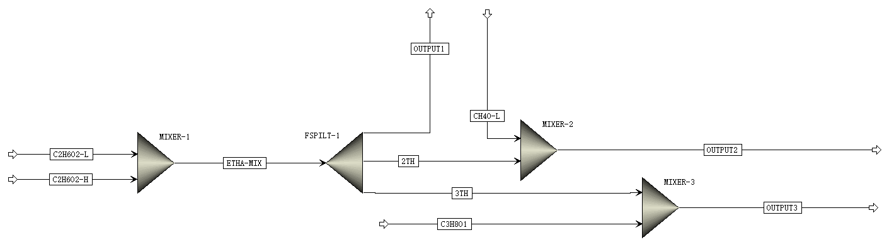

# CAPD 培训班练习一作答

**学号**：12115990136
**姓名**：刘抗非
**课程**：化工过程模拟及软件应用——AspenPlus应用

---

## 目的

1. 练习用 Aspen Plus 进行流程仿真的基本步骤
2. 掌握 Mixer、FSplit、Mult、Dupl 的用法

## 问题1

### 流程图

### 输入参数

#### 高浓酒精

#### 低浓酒精

#### 正丙醇溶液

#### 甲醇溶液

### 结果分析

根据仿真结果图:

## 问题2

### 流程图

### 输入参数

与问题1相同,不再重复列出。

### 结果分析

根据仿真结果图:

